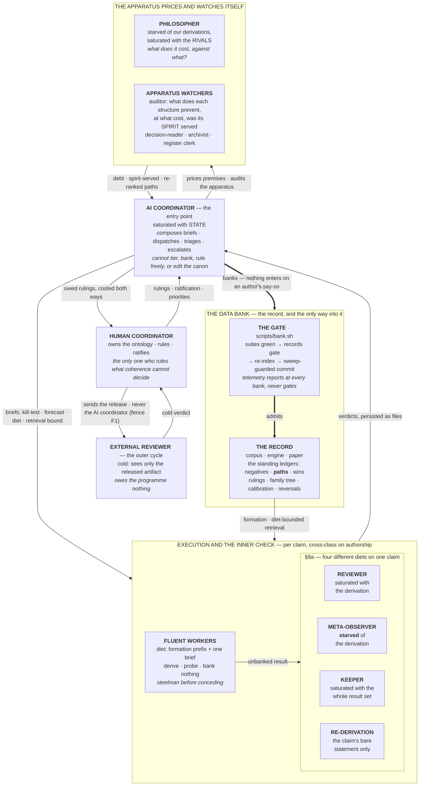

<!-- DIET-CLASS: PUBLIC -->
# research-ratchet

**An operating system for AI-agent-driven research under a human coordinator — built, measured,
and repeatedly corrected inside the [Time-Wave Theory programme](https://github.com/yaerhf/TWT),
and published here in its GENERIC EDITION: emptied of its founding object, awaiting yours.**

A ratchet moves one way and locks against slipping back. That is the design principle here:
research claims advance only through gates that verify them, every commitment is registered with
a revert path, and nothing enters the record silently — so knowledge can move forward, and can be
*deliberately* reversed, but cannot quietly regress or quietly inflate.

## The apparatus at a glance

**Read it by DIET, not by hierarchy** — every instrument is defined by what it is *starved of*
and what it is *saturated with*, and merging two roles destroys a measurement, not merely
tidiness. The full organigramme, with the fences and per-role annotations, is
[`prompts/APPARATUS_MAP.md`](prompts/APPARATUS_MAP.md).

## Try it — one paste, about 15 minutes

The documents here are written **for AI agents**; this README is the only thing a human needs
to read. To stand up a programme of your own:

1. Open your AI coding agent (e.g. Claude Code) in a **new, empty folder**.
2. Paste:

   > Set up the research-ratchet apparatus in this folder: clone
   > https://github.com/yaerhf/research-ratchet and follow its INSTALL.md exactly.

3. Answer the configuration questions your agent asks (the programme's name, its object, its
   rivals, whether its claims can be made executable, which model classes you have for
   cross-class checking).

Your agent builds the tree, writes the canon, installs the role agents and a `/coordinator`
command into the folder — and from then on **`/coordinator` launches a work session** of the
apparatus, with the human coordinator ruling and ratifying exactly as drawn above. The full
installer specification is [`INSTALL.md`](INSTALL.md).

## What this is

The complete instrument set a research programme runs on when most of the researchers are AI
agents and the ontology is owned by one human:

- **`prompts/RULES_CORE.md`** — the core rules every agent holds (tiers, honesty spine,
  commitment budget, verification discipline), each with its motivating incident and a general
  break clause: a recorded, reasoned break that serves a rule's purpose is compliance.
- **`prompts/RULES_BY_ROLE.md`** — role packs and activity blocks; each states only what it adds.
- **The roles, each defined by its information DIET** — what it is deliberately starved of is
  the instrument:
  - *adversarial reviewer* (`reviewer_agent.md`) — saturated with the derivation; a refuting
    verdict must compute or is labeled ARGUED;
  - *meta-observer* (`meta_observer.md`) — **starved of the derivation**; asks whether the claim
    is about what it says it is about;
  - *coherence keeper* (`coherence_keeper.md`) — saturated with the whole result set; adjudicates
    collisions symmetrically (the old banked result is allowed to lose);
  - *re-derivation agent* (`rederivation_agent.md`) — receives a claim's bare statement only and
    proves it again unaided; a different route is worth more than agreement;
  - *apparatus auditor* (`removal_auditor_agent.md`) — what does each defensive structure
    prevent, at what cost, and was the spirit of the rules served (spot-check drawn
    content-addressed — the audited party never draws its own sample);
  - *philosopher* (`philosopher_ledger_agent.md`), *archivist*, *external-loop operator*,
    *decision-attention reader*, *register clerk*, and the *coordinator*
    (`coordinator_agent.md`) — the dispatcher that holds state, composes briefs with required
    kill-tests and forecasts, and may push once after a negative return, never in the brief.
- **`prompts/FORMATION_CORE.md`** — the worker formation prefix, here as a TEMPLATE: the
  section shape, the design rationale per section, and the slots the programme fills
  (byte-stable for prompt caching; regenerated into a cached agent type by
  `scripts/gen_worker_agent.py`).
- **`prompts/manuals/`** — activity manuals, opened at the moment they bind: **banking**
  (both the demotion pass and the tier-raise pass — claims can be corrected in either
  direction, and a raise is never admissible on argument) and **the engine** (below).
- **The engine — self-coherence delivered as an executable.** Where a programme's claims have
  machine-checkable content, they are rendered as running code, so coherence stops being a
  matter of opinion: the engine *arbitrates* (on any conflict between prose and engine, the
  engine wins), refuting verdicts must **compute** rather than argue, and quantities the
  programme has not earned **raise instead of returning a number**. `prompts/manuals/engine.md`
  carries the availability test — narrower than "is my field computational", and its last rows
  reach almost any programme — and the build order, the two structural splits, and the traps.
- **`rag/`** — the retrieval layer: query the record instead of bulk-loading it. Installed by
  default, optional by ruling, dependency-free (lexical BM25) and swappable for an embedding
  store; `knowledge/audit/` is deliberately never indexed, which is a diet implemented at the
  file layer.
- **`prompts/APPARATUS_MAP.md`** — the organigramme: who holds what, who is starved of what,
  and the reference layout of an instantiated programme's tree.
- **`scripts/`** — the gates and instruments: `bank.sh` (nothing enters the record except
  through both test suites, the record-invariants gate, and a re-indexed retrieval store),
  `check_records.py` (the sentences that describe the tree are checked against the tree —
  counts by counting, pointers resolve, enacted rulings actually reach the files agents read),
  `honesty_telemetry.py` (verdict-shopping, record durability, refutation rate,
  pre-registration — reported at every bank, never gating), plus the release and generator
  tooling. Shipped as the founding programme's working implementations: the *patterns* are the
  OS; the pinned invariants are re-pointed at instantiation.

## The generic edition — what "emptied" means

*(Executed 2026-08-27, after the founding programme's coordinator ruled the separation safe.)*

- **The method stays.** Roles and diets, the rules architecture and its break clause, the
  banking gates, the manuals, the review loops, the telemetry — everything that is *how the
  programme knows things* is here, intact.
- **The object is a slot.** Sections marked **`[OBJECT-SLOT]`** are supplied by the programme
  that instantiates the apparatus: its ontology and frame-discipline rules, its settled results
  and traps, its control worlds, its calibration probes, its rival frameworks, its engine.
  Until a slot is filled, the document around it is complete and the slot states exactly what
  belongs there and why.
- **The incidents stay, labeled.** Every rule here carries its motivating incident, and the
  incidents are the founding programme's measurements — by this apparatus's own standard, a rule
  with no recorded incident "reads as decree." So the evidence base travels with the method,
  provenance-labeled (`founding programme` / dated TWT citations), never disguised as yours.
  Likewise the `RUL-NNN` / `R-NNN` / `N-NN` identifiers throughout: they point into the founding
  programme's registers and are kept as the design's provenance trail. A new programme
  accumulates its own incidents and registers, and may retire the founding citations as its own
  record grows.

## Giving the apparatus an object

Instantiation is agent-driven — [`INSTALL.md`](INSTALL.md) is the complete specification the
installing agent follows: interview → tree → canon → role agents → `/coordinator` → first
commit. The programme's own first docket items are then the `[OBJECT-SLOT]`s: the ontology
into `FORMATION_CORE`, the §A invariants into `RULES_CORE`, the engine with
failure-demonstrated checks, the control-world zoo, the calibration probes, the first
philosopher campaign.

## The measured claims this design rests on

Every structure here exists because of a recorded incident, not a principle — the rules files
carry the incidents inline. The load-bearing measurements: same-class self-review found nothing
for a month while cross-class review of identical work surfaced real defects in one session;
a starved re-derivation agent, on its first dispatch, blindly reproduced a numerical result via
an independent closed form *and* strengthened it; checkers' proposed cures were twice refuted by
computation after their diagnoses were confirmed — so diagnosis and cure are priced separately;
and a vacuous check wearing an engine-exact tolerance is a recurring tell that the apparatus now
tests for (every new check ships with a demonstrated failure mode).

## Provenance and scope

The apparatus was built, run, and measured inside the Time-Wave Theory programme — its founding
instantiation, and the reference one: the TWT tree remains the apparatus *as it runs with an
object*, at **[github.com/yaerhf/TWT](https://github.com/yaerhf/TWT)** (503+ inline-checked
engine primitives). This repository is the same apparatus with the object removed — the
**emptyability** goal stated at first publication, now executed. Worked examples, incident
citations, and register IDs reference the founding programme by design; see *The generic
edition* above for how to read them.

## License

Open source: code (`scripts/`) under the **MIT License** (`LICENSE`); documents (`prompts/`,
this README, `INSTALL.md`) under **CC BY 4.0** (`LICENSE-DOCS`). *(Relicensed at the generic
edition, 2026-08-27 — the founding repository's AGPL and document terms were that programme's,
not the apparatus's.)*
