# THE APPARATUS — organigramme, roles, and where everything lives

**v1, 2026-08-19.** Written at the human coordinator's request: *"draw an organigramme of the
apparatus with the roles and folder organization. I need to see it clear-minded."*

> **What this is.** The program has an unusual amount of machinery — role definitions with
> deliberately different information diets, three registries, an executable oracle, a records gate,
> an outer review cycle. It accreted over months and has never been drawn in one place. This is
> that drawing. **It is descriptive, not normative** — the binding rules live in `AGENT_RULES.md`
> beside it, and the canon governs both.
>
> **The apparatus is a program asset in its own right**, and is in principle exportable to other
> research programs. That is a reason to keep it legible.

---

## 1. THE ORGANIGRAMME

```mermaid
flowchart TB
    HC["<b>HUMAN COORDINATOR</b><br/>owns the ontology · rules · ratifies<br/><i>final authority; the only one who rules class-(3)</i>"]

    subgraph ENTRY [" "]
        AC["<b>AI COORDINATOR</b> — the entry point<br/>saturated with STATE<br/>dispatches · composes briefs · triages · escalates<br/><i>cannot tier, bank, rule freely, or edit the canon</i>"]
    end

    HC -->|"rulings, ratification, priorities"| AC
    AC -->|"owed rulings, costed both ways"| HC

    subgraph DO ["EXECUTION"]
        W["<b>FLUENT WORKERS</b><br/>diet: FORMATION_CORE + one brief<br/><i>execute; bank nothing</i><br/><i>§8a duty (RUL-075): STEELMAN before conceding —<br/>question the adversarial review</i>"]
    end

    subgraph INNER ["§8a — THE INNER CHECK (per claim; cross-class on authorship)"]
        RV["<b>REVIEWER</b><br/>saturated: the derivation<br/><i>sound and honestly tiered?</i><br/><i>a refutation COMPUTES or is labeled ARGUED (R5)</i>"]
        MO["<b>META-OBSERVER</b><br/><b>STARVED of the derivation</b><br/><i>is it ABOUT what it says?</i><br/><i>owns prior-art (F3; ex-N3)</i>"]
        KP["<b>KEEPER</b><br/>saturated: the whole result set<br/><i>does the corpus assert one thing?</i>"]
        RD["<b>RE-DERIVATION AGENT</b> (2026-08-21, first run blind-REPRODUCED)<br/><b>STARVED of the derivation, the probes, ALL verdicts</b><br/>diet: the claim's BARE STATEMENT only<br/><i>prove it again; a different route beats agreement</i>"]
    end

    subgraph PHIL ["THE PHILOSOPHER (split role, fence F4)"]
        PW["<b>WORKER capacity</b><br/>the isolated premises + literature<br/><i>could this premise have been otherwise?</i>"]
        PC["<b>CHECKER capacity</b><br/>starved of our derivations, saturated with RIVALS<br/><i>what does it cost, against what?</i>"]
        PA["<b>CONTRA-REVIEWER</b> (RUL-044)<br/><i>argues against every conclusion before it lands</i>"]
    end

    subgraph OUTER ["THE OUTER CYCLE — external review loop"]
        XR["<b>EXTERNAL REVIEWER</b><br/><b>STARVED of everything but the artifact</b><br/>held-out = Fable · recurrent = Opus<br/><i>fence F1: never formed in-session</i>"]
    end

    subgraph RARE ["NON-FREQUENT ROLES"]
        N1["<b>APPARATUS AUDITOR</b> (N1, RUL-072 merge)<br/>what is here to prevent something, at what cost?<br/>+ was the SPIRIT of the rules served?<br/><i>MANDATORY before any cut · spot-check lottery</i>"]
        N2["<b>DECISION-ATTENTION READER</b> (N2)<br/><i>at each release</i>"]
        AR["<b>ARCHIVIST</b><br/>structural hygiene only<br/><i>never semantic judgment</i>"]
    end

    GEM["<b>GEMINI</b> — ideation only<br/><i>numbers carry ZERO evidential weight</i>"]

    AC --> W
    AC --> RV & MO & KP & RD
    AC --> PW & PC
    AC --> N1 & N2 & AR & RC
    RC["<b>REGISTER CLERK</b> (Haiku, PILOT — RUL-079)<br/>quotes + pointers, read-only, as-of-commit"]
    %% N3 (prior-art sweep) RETIRED into the meta-observer's F3 axis (RUL-073, 2026-08-21) —
    %% F3 is where that work structurally lives (the reviewer has no web tools). A one-time
    %% back-catalogue sweep, if ever wanted, is commissioned as a TASK, not a role.
    %% ROLE-COUNT GOVERNANCE (RUL-074, 2026-08-21): adding roles AND changing any count
    %% constraint are both under the HUMAN COORDINATOR'S approval; a freeze was proposed by
    %% the adverse review and REFUSED (bloat noted, approval gate preferred).
    AC -.->|"orchestrates, never forms"| XR
    GEM -.->|"CANDIDATE only"| AC
    PW --> PA
    PC --> PA

    W -->|"unbanked result"| RV
    RV & MO & KP -->|"HOLDS / REFUTED / LOCATED-GAP / OVER-CLAIM / UNDER-CLAIM"| AC
    RD -->|"REPRODUCED / +DELTA / BLOCKED / CONTRADICTED"| AC
    XR -->|"cold verdict"| AC

    AC ==>|"banks"| BANK

    subgraph BANK ["scripts/bank.sh — THE ONLY WAY IN"]
        G1["1. both suites green"]
        G2["2. check_records.py — prose vs tree"]
        G3["3. RAG re-ingest"]
        G4["4. commit (sweep-guarded)"]
        G1 --> G2 --> G3 --> G4
    end
```



**Read the diagram by DIET, not by hierarchy.** Every instrument here is defined by what it is
**starved of** and what it is **saturated with**. Merging two roles destroys a measurement, not
merely tidiness — the meta-observer is only useful *because* it never sees the derivation.

---

## 2. THE ROLES, ONE LINE EACH

| role | file | starved of | saturated with | its one question |
|---|---|---|---|---|
| Human coordinator | — | — | the ontology, twenty years of it | *is this what I mean?* |
| **AI coordinator** | `coordinator_agent.md` | — | state | *who should hold what?* |
| Fluent worker | `FORMATION_CORE.md` + brief | everything not in its brief | its task | *what does the substrate say?* |
| Reviewer | `twt_reviewer_agent.md` | — | the derivation | *sound and honestly tiered?* |
| Meta-observer | `meta_observer.md` | **the derivation** | the claim, the world | *is it ABOUT what it says?* |
| Keeper | `coherence_keeper.md` | — | the whole result set | *does the corpus assert one thing?* |
| Philosopher (worker) | `philosopher_ledger_agent.md` | — | isolated premises + literature | *could this have been otherwise?* |
| Philosopher (checker) | same file, F4 split | our derivations | the rivals | *what does it cost, against what?* |
| External reviewer | `external_review_loop.md` | **everything but the artifact** | — | *is it legible from outside?* |
| Removal auditor (N1) | `removal_auditor_agent.md` | — | the defensive structures | *what breaks if this goes?* |
| Decision-attention reader (N2) | `decision_attention_reader.md` | — | the release artifact | *what must the human decide?* |
| Archivist | `archivist_agent.md` | **the physics** | the record's shape | *is it navigable and current?* |
| Register clerk (PILOT) | `register_clerk.md` | the physics corpus | the registers, at formation | *what does the record say, verbatim?* |
| Re-derivation agent | `rederivation_agent.md` | **derivation, probes, all verdicts** | the bare statement | *can I prove it again, unaided?* |

**N1 NOW HAS A DURABLE FILE (2026-08-20)** — written with recommendation **R-A** built in, so the
role asks two questions rather than one: *what does this prevent?* **and *what does it cost per
pass?*** The second exists because **every addition to this apparatus has a champion — its
motivating incident — and no removal has one**, which means the apparatus can otherwise only
accumulate until impatience removes things, and impatience removes exactly the class N1 protects.
**N2 was written 2026-08-20** (`decision_attention_reader.md`; runs at each release, asking what
the human must DECIDE and whether their agents can extract it). A role whose reasoning is
reconstructed at each dispatch is a role that will drift — which is why N1, N2 and the
re-derivation agent all now have durable files.

---

## 3. FOLDER ORGANIZATION — what is where, and who reads it

```
CLAUDE.md                    THE CANON — auto-loaded into every session, un-compactable.
                             Binding on everyone. Keep it small; prune as much as you add.

knowledge/
├── prompts/                 ★ THE APPARATUS ITSELF  ⚠ gitignored wholesale — force-add new files
│   ├── FORMATION_CORE.md      the worker prefix (versioned; changes only at consolidation)
│   ├── APPARATUS_MAP.md       this file
│   ├── AGENT_RULES.md         the rules, by when they bite (+ the live divergence table)
│   ├── RULES_CORE.md          the core rules that bind everyone (count in its header) · RULES_BY_ROLE.md  the role packs
│   ├── PROFILES.md            the disposition axis (steelman RESOLVED into the worker duty, RUL-075)
│   ├── manuals/               activity manuals (banking.md carries the demotion AND tier-raise passes)
│   ├── enforcer_agent.md      MERGED into removal_auditor_agent.md (the APPARATUS AUDITOR, RUL-072) — stub only
│   ├── removal_auditor_agent.md  ★ THE APPARATUS AUDITOR (N1 + ex-enforcer): prevents/costs + spirit-served
│   ├── decision_attention_reader.md  N2 — at each release: what must the human DECIDE?
│   ├── rederivation_agent.md  prove it again from the BARE STATEMENT (forbidden the derivation)
│   ├── register_clerk.md      Haiku PILOT (RUL-079): registers held in context, quote-only, read-only
│   ├── coordinator_agent.md   ★ THE ENTRY POINT ROUTINE (incl. the post-negative push, RUL-078)
│   ├── twt_reviewer_agent.md / meta_observer.md / coherence_keeper.md      the §8a triad
│   ├── philosopher_ledger_agent.md · archivist_agent.md                    other roles
│   ├── external_review_loop.md    the OUTER CYCLE routine
│   ├── calibration_probes.md      run BLIND before trusting any checker
│   ├── paper_rework_lessons.md    read before ANY paper edit
│   ├── psychology_of_ai_reviewers.md · coherence_audit.md · adversarial_review.md
│   └── *_session.md               ⚠ LEGACY entry points — superseded by the coordinator routine
│
├── corpus/                  THE ARTIFACT + THE ORACLE
│   ├── TWT_foundational_paper.md            V3 · HISTORY-BLIND by ruling
│   ├── TWT_foundational_paper_companion.md  Result Index · dependency graph · dev log · imports
│   ├── twt.py                MAIN engine — executable ground truth (~255 public)
│   ├── twt_companion.py      COMPANION engine (~64 public; MAIN never calls it)
│   └── twt_test.py · twt_companion_test.py   the two harnesses (422 + 87 as of 2026-08-21)
│
├── ledgers/                 THE 12 STANDING LEDGERS — all indexed by RAG
│   ├── TWT_RULING_REGISTER.md      rulings in force + GROUNDS + revert lists
│   ├── TWT_FAMILY_TREE.md          Core vs Instance: the pick register
│   ├── TWT_NEGATIVES_LEDGER.md     tried → failed because → would change if
│   ├── TWT_COMPARATIVE_LEDGER.md   the ontological debt ledger (philosopher's output)
│   ├── TWT_CHECKER_CALIBRATION.md  overturned verdicts + blind probe runs
│   ├── TWT_EDIT_REACTION_LEDGER.md edit → external reaction history
│   ├── TWT_worklist.md             ★ THE DOCKET + the do-not-compress meaning-notes region
│   ├── TWT_STRATEGIC_MAP.md · TWT_EOM_MAP.md · TWT_DEFECT_CKM_GLUON.md · TWT_PHILOSOPHER_LOG.md
│
├── audit/                   GOVERNING RECORDS, dated  ⚠ NOT in the RAG index, BY DESIGN
│   ├── SESSION_HANDOFF_*.md     ★ READ FIRST — live state; reachable ONLY via canon §9
│   ├── pivot_2026-08-17/        the Core/Instance split + the CHARTER
│   ├── external_review_2026-08-13/   round 1 + MERGE_PLAN + ACTION_PLAN
│   └── consolidation_2026-08-18/     this arc's records
│
└── candidates/              CANDIDATE material — probes, memos, unadjudicated work

scripts/     bank.sh (the only way in) · check_records.py (the records gate) · render_pdf.sh
rag/         ingest.py · query.py — the retrieval layer (⚠ globs are non-recursive)
gemini/      the ideation advisor (numbers: zero weight)
simulator/   the GA-native simulator subproject
```

**Three structural facts worth seeing at once:**
1. **`knowledge/prompts/` — the apparatus itself — is gitignored wholesale.** Files added there are
   invisible to git by default; five were found untracked on 2026-08-19. **Force-add every new one.**
2. **`knowledge/audit/` is deliberately outside RAG**, so governing records are reachable only by
   explicit pointer. The handoff's sole path is the canon §9 line. **Do not remove it.**
3. **The engines are indexed and chunked per primitive** — so a primitive can be *queried* at ~8×
   less context than reading the file. Long docstrings fragment that, and fences can be stripped
   from all but one chunk.

---

## 4. THE THREE CYCLES

**INNER — per claim.** worker produces → §8a checks with three different diets → coordinator
triages → banks. *Nothing is banked on the developer's say-so alone.*

**MIDDLE — per arc.** docket item → work → consolidation (banking triage · archivist pass · N1 ·
the M1 offer judgment · prefix re-version · handoff rewrite · bank + tag).

**OUTER — per release.** release → cold measurement → adjudicate → correct → re-release.
*The program's only external forcing function.* The coordinator drives it and never forms the
reader.

---

## 5. THE ENTRY POINT, AND WHAT IT SUPERSEDES

**`coordinator_agent.md` is the entry point.** A session starts by forming the coordinator, which
then dispatches everything else.

**The `*_session.md` routines are the LEGACY entry points** — `consolidation_session.md`,
`worklist_session.md`, `remediation_session.md`, `theta_rel_session.md`, and the two `class2_*`
campaign briefs. They were written when a session *was* its type, before the coordinator role
existed. Several are now partly restated inside `coordinator_agent.md` (the consolidation ritual is
the clearest case). **They are not yet marked as superseded, and at least one — the consolidation
ritual — now exists in two places that can drift apart.** Cleaning them is docketed: the question
for each is whether it is *dead*, *folded into the coordinator routine*, or *still a live
specialist routine the coordinator dispatches into*.

---

## 6. WHAT THE APPARATUS DOES NOT DO — measured, not assumed

Recorded here because a map that shows only what works is a sales brochure. All four were
established by deliberately breaking things on 2026-08-19.

- **One gate does not guard.** Of five raising gates, four fire under sabotage and one is
  unreachable because its configuration is never constructed. Both suites stay green.
- **Striking an import-registry row breaks nothing and warns nobody** — uniqueness is checked,
  referential integrity is not.
- **The suites verify the mathematics, not the prose.** ~74% of engine docstring content is prose
  no assert can express; ~18,800 tokens of it are claims with no equation and no number.
- **The gate machinery guards the door, not the wall.** It catches a gate that stopped raising. It
  does not catch a *new* primitive that returns an unearned number without touching a gate. That
  remains a human duty, and it is the reason the §8a roles exist.
